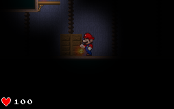
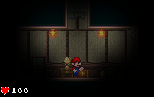
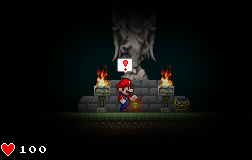

Super-Mario-Heart-Attack
========================

Super Mario Hear Attack is a big example on how to use Tiled and Tiled Map Loader to make some awesome games with Clickteam Fusion 2.5

Screenshots
===========

* 
* 
* 

Play
====

If you just want to play, run ``` Super Mario Heart Attack.exe ```

Features
========

This example contains the following features:

  - Full Tiled map loading and rendering
  - One frame engine with no restart to change map
  - Physic support
  - Very nice light effects

Requisites
==========

- You'll need to own Clickteam Fusion 2.5 to open this example: http://www.clickteam.com/clickteam-fusion-2-5
- You'll need to copy all the content of ``` the documentation/clickteam-fusion ``` folder to your Clickteam Fusion 2.5 folder
- Open the ``` Super Mario Heart Attack.mfa ``` with CF2.5, if asked about missing extensions, look for them in the Extension Manager
- You're good to go
